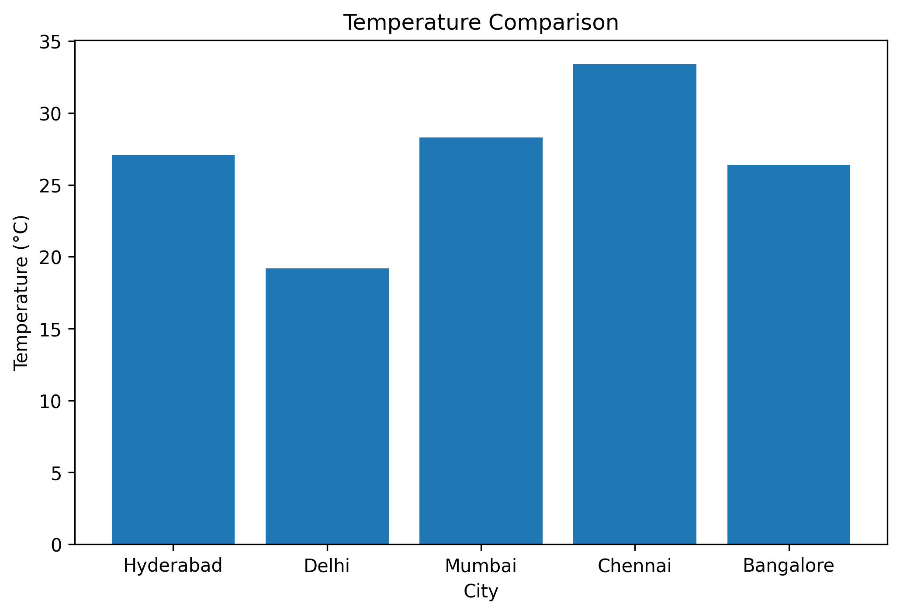
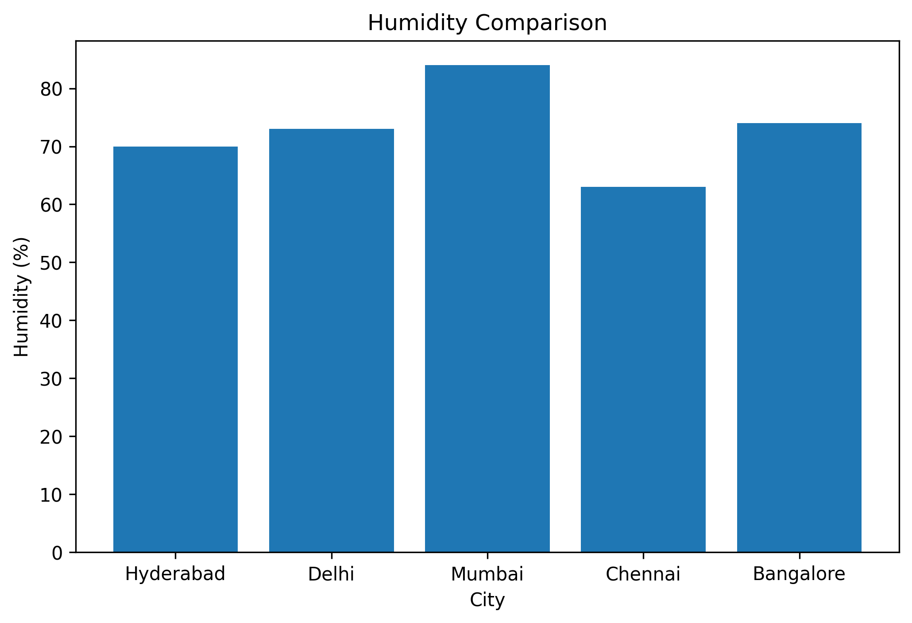
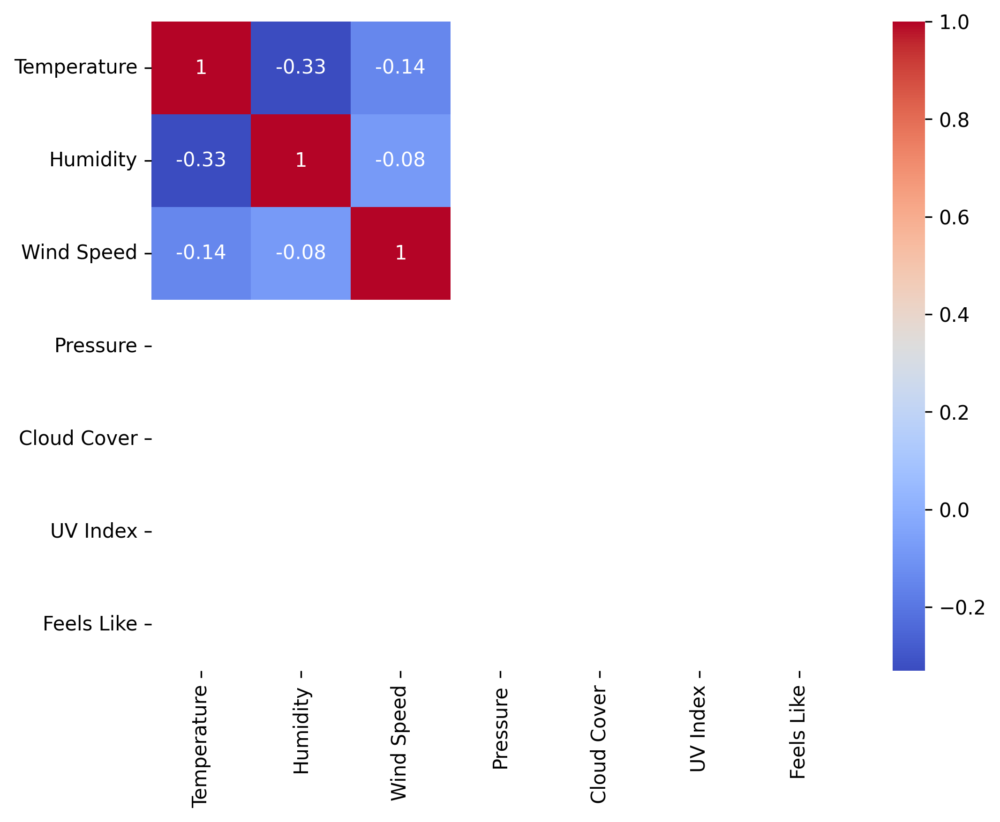

# 🌦 Weather Analysis API Project

## 📌 Overview

This project fetches real-time weather data from WeatherAPI and performs Exploratory Data Analysis (EDA) using Python. It compares weather conditions across major Indian cities and visualizes important metrics like temperature, humidity, and wind speed.

---

## 🎯 Objective

Analyze weather conditions across major Indian cities using real-time API data and generate meaningful insights through data analysis and visualization.

---

## 🛠 Technologies Used

- Python
- Requests
- Pandas
- Matplotlib
- Seaborn
- WeatherAPI
- Google Colab

---

## 📊 Features

- Fetch live weather data using WeatherAPI
- Convert JSON response into a Pandas DataFrame
- Perform Exploratory Data Analysis (EDA)
- Visualize weather data
- Find hottest and coldest cities
- Export processed data to CSV

---

## 📈 Visualizations

### Temperature Comparison



### Humidity Comparison



### Correlation Heatmap



---

## 📂 Project Structure

```
Weather-Analysis-API-Project/
│
├── weather_analysis.ipynb
├── weather_data.csv
├── README.md
├── requirements.txt
├── heatmap.png
├── humidity_comparison.png
├── temperature_comparison.png
└── .gitignore
```

---

## 📊 Key Insights

- Chennai recorded the highest temperature.
- Mumbai recorded the highest humidity.
- WeatherAPI provides reliable real-time weather data.
- Python libraries made data cleaning and visualization straightforward.

---

## 🚀 Future Improvements

- Historical weather tracking
- Interactive Streamlit Dashboard
- Temperature Prediction using Machine Learning
- Weather Forecast Dashboard

---

## 👨‍💻 Author

**Anish Ramarthi**

Aspiring Data Scientist
